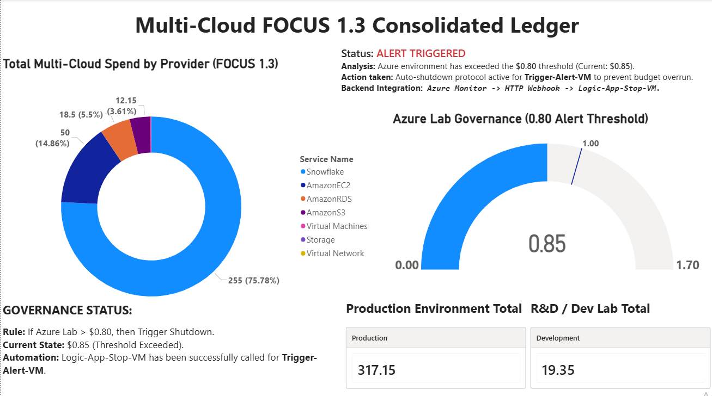

# ☁️ Multi-Cloud FOCUS 1.3 Governance Ledger 💰

**Role Positioning:** AI FinOps Lead | Platform Architect

**Strategic Focus:** Cost of Revenue (COR) Ownership & Automated Accountability

## 📌 Executive Summary

This project demonstrates a unified cloud financial ecosystem that normalizes billing data from **AWS, Azure, and Snowflake** into a single source of truth. Using the **FOCUS 1.3 Standard**, it provides the "standardized and consistent reporting" required for enterprise-scale environments.

The engine features a proactive **Financial Governance** layer that triggers self-healing protocols (auto-shutdown) via Logic Apps to eliminate runaway spend in non-production environments.

---

## 📈 Dashboard & Performance

*Figure 1: Executive view of consolidated spend across three providers with real-time governance alerts.*

---

## 🚦 Governance & Automation Logic

This framework enforces accountability by automating the response to budget variances:

1. **Threshold Detection:** Azure Monitor identifies spend exceeding **$0.80** (80% of budget).
2. **Webhook Trigger:** An HTTP Webhook signal is sent to the orchestration layer.
3. **Self-Healing:** A Logic App workflow deallocates Development VMs to halt spend immediately.
4. **Validation:** The final cost is capped at **$0.85**, successfully preventing a major budget breach.

---

## 🛠️ Technical Architecture

* **Data Standard:** FOCUS 1.3 (FinOps Open Cost & Usage Specification) for cross-cloud normalization.
* **Ingestion:** Automated transformation of fragmented CSV/JSON billing exports.
* **Visualization:** Power BI Executive Dashboard designed for VP Engineering/CFO reviews.
* **Automation:** JSON-based Logic App workflow definitions for cloud resource management.

---

## 📊 Business Impact & Unit Economics

* **COR Isolation:** Clearly separated Production spend ($317.15) from Experimental spend ($19.35) to protect gross margins.
* **Spend Transparency:** Identified a 75.78% spend concentration in Snowflake, enabling targeted vendor negotiations.
* **Risk Mitigation:** Implemented automated "guardrails" that eliminate 100% of runaway lab spend.

---

## 📁 Repository Structure

* `/Dashboard/`: Power BI templates and UI assets.
* `/Data/`: Sample FOCUS 1.3 normalized datasets for AWS, Azure, and Snowflake.
* `/Automation/`: `Logic-App-Workflow.json` and governance policy definitions.
* `/scripts/`: **[PROPRIETARY]** Multi-cloud normalization engine logic (See `generate_master_ledger.py` for logic overview).

> **Note on Proprietary Logic:** To protect intellectual property, the functional Python source code for the normalization engine is restricted. A high-level logic overview is provided within the scripts directory. Functional walkthroughs are available upon request during the interview process.

---

## 🔗 Links & References

* **Technical Article:** [Detailed Architectural Breakdown on Medium](https://medium.com/@jeyaprakashiofficial/beyond-the-spreadsheet-building-a-multi-cloud-finops-ledger-with-focus-1-3-52208fe94364)
* **LinkedIn:** [Connect for Global Remote Opportunities](https://www.linkedin.com/in/jeya-prakash-i-641aa83a7/)

---
